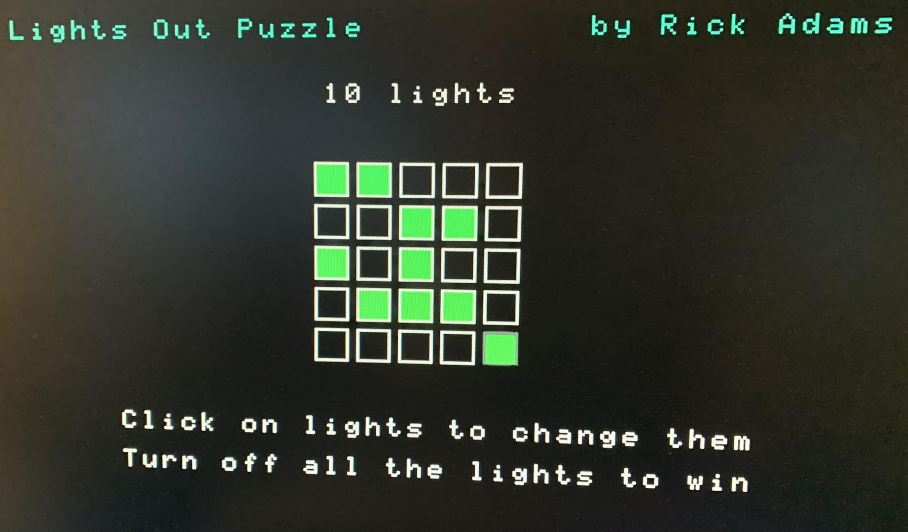

LIGHTSOUT: The "Lights Out" puzzle in BASIC for a Tandy Color Computer 3
==========

This BASIC game will display a random pattern of lights; to win the game, use the joystick to select and
click on lights to change which lights are lit.  Can you figure out a strategy to turn off all the lights
and win the game?

`redistribute/lights.bas` is the BASIC program to use; the other `lights.bas` file is the source before
being run through my BASIC preprocessor utility, which is in another of my repositories.
